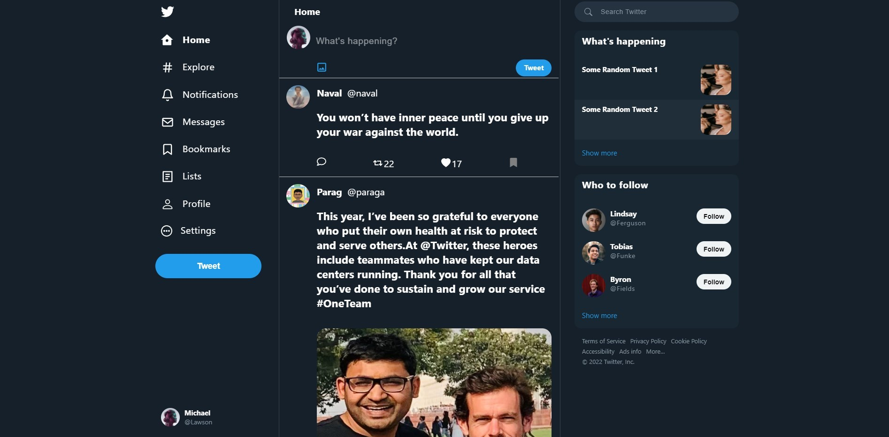
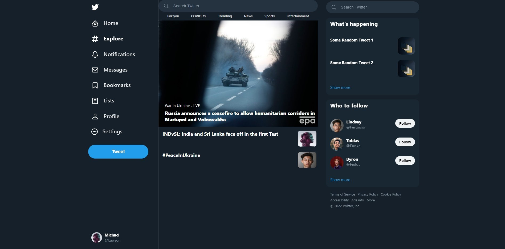
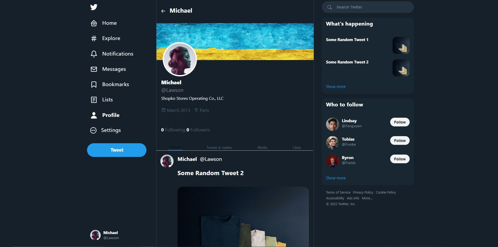
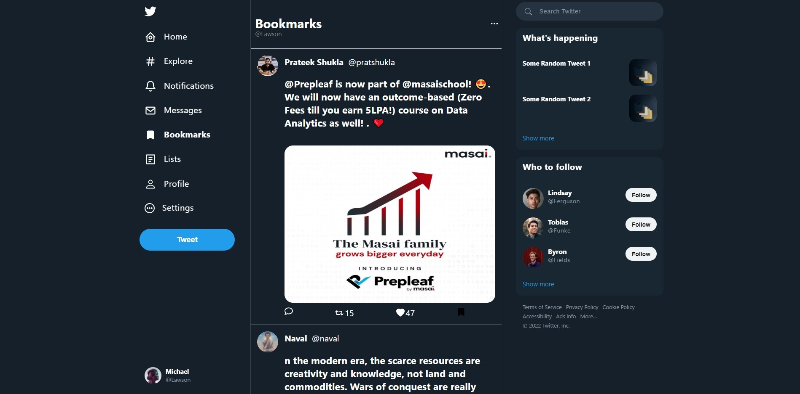
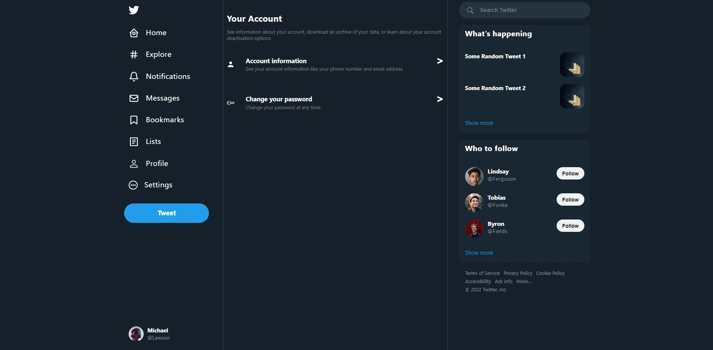

<h1 align="center">Welcome to Chirp 👋</h1>

<br/>

<strong>Twitter</strong> is an American microblogging and social networking service on which users post and interact with messages known as "tweets".Registered users can post, like, and retweet tweets.

In this project we have tried to clone the basic layout of <strong>Twitter</strong>. With our efforts and the technology stack, that we have learned so far in the masai school, we were able to clone the front end and some basic functionalities.

<br/>

- This is a react clone of the Twitter website
- and it was made in 1 week.
- The technologies used are used because they are beginner friendly and easy to use.
- The project had some time constraints and most of the indepth features are still in progress.
- If you are interested in contributing to this project feel free to do so.

<br/>

# Dependencies and Tech stack used 💻

- [React](https://reactjs.org/)
- [Redux Toolkit](https://redux-toolkit.js.org/)
- [Axios](https://www.npmjs.com/package/axios)
- [React Icons](https://react-icons.github.io/react-icons/)
- [Styled Components](https://styled-components.com/)
- REST API for data on heroku https://chirp-database.herokuapp.com/

### 🏠 [Homepage](https://chirp-abhi-aro.vercel.app/)

### ✨ [Demo](https://masai-course.s3.ap-south-1.amazonaws.com/users/1421/submissions/261280/426957/b486505f2080d6b12df6e712a6da353f/video12821563428.mp4)

<br/>

# Features ✨

1. User can create a new account or login using phone number or email.
1. User can change their password and view their account information.
1. User can create tweets like: text, pictures, videos.
1. User can add and remove bookmarks on tweets.
1. User can like and unlike tweets.
1. User can add and remove retweets.
1. User can search and view other users.

<br/>

# How to run the project 📑

### After cloning the project from https://github.com/abhi-aro/Chirp.git

## Install using

```sh
npm install
```

## Run using

```sh
npm run start
```

  <br/>
  <br/>

# Highlights 📷

## Home



## Explore



## Profile



## Bookmarks



## Settings



---

<br/>

## Authors

👤 **Abhishek**

- Website: [Portfolio](https://abhi-aro.tech/)
- Github: [@abhi-aro](https://github.com/abhi-aro)
- LinkedIn: [@abhi-aro](https://linkedin.com/in/abhi-aro)

👤 **Sachin Gupta**

- Website: [Portfolio](https://sachin-gupta.netlify.app/)
- Github: [@Guptaji03](https://github.com/Guptaji03)
- LinkedIn: [@sachin-gupta-282a57220](https://www.linkedin.com/in/sachin-gupta-282a57220/)

👤 **Suraj Himanshu**

- Website: [Portfolio](https://suraj-himanshu-portfolio.herokuapp.com/)
- Github: [@surajhimanshu](https://github.com/surajhimanshu)
- LinkedIn: [@suraj-himanshu-9aa58215a](https://www.linkedin.com/in/suraj-himanshu-9aa58215a/)

## Show your support

Give a ⭐️ if you liked this project!

---
